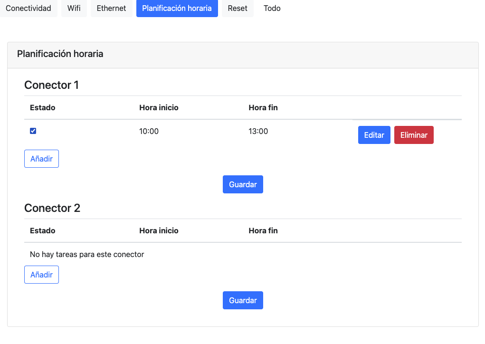

# Orbis - angular-test-1

## Introducción

Bienvenido a la prueba técnica sobre Angular del equipo de desarrollo de Orbis Tecnología Eléctrica S.A. \
En éste reto te proponemos unas sencillas tareas para ver qué tal te desenvuelves con Angular, ya que es la librería que utilizamos en nuestra plataforma web [puedes verla aquí](https://iot.orbis.com.es/).

## Requisitos técnicos
- Angular 15
- ng-boostrap 14.x (como framework que utilizamos para diseño)
- versión de node recomendada: v16.15.0

## Preparación del proyecto
Para iniciar la prueba, debes poder ejecutar localmente este proyecto. Puedes usar `yarn install` para instalar las dependencias del proyecto y `yarn start` para ejecutarlo.

Una vez ejecutado, podrás acceder a la web local abriendio la siguiente dirección en el navegador: http://localhost:4200/
En este momento deberías poder ver una página de login. Puedes loguearte usando alguno de los credenciales de acceso que puedes encontrar en el documento users.json.

Una vez que hayas hecho login, te abrirá una página `settings` con varia información. Esta página de ajustes no permite salvar las modificaciones, por lo que no te preocupes si se muestra un mensaje de error cuando pulsas el botón guardar, es normal.

# Objetivos
El objetivo de la prueba es superar cada uno de los apartados que se definen a continuación:
## Resolución de errores
En este apartado queremos ver tu capacidad para resolver pequeños bugs que encontrarás en tu día a día en Orbis. Para ello vamos a describir alguno de los errores que se puede encontrar el usuario al usar este proyecto y tu objetivo será analizarlos, intentar identificar la causa de los mismos y solventarlos. Interesaría que realizases una pequeña guía de qué pasos has seguido para identificarlos y solucionarlos.

Los errores son los siguientes:
- **Popup que no se cierra**: Si un usuario reliza una modificación en el campo SSID de la tarjeta Conectividad y da a Guardar, se queda abierto de forma indefinida un popup. El popup debería cerrarse sólo una vez que llegue el mensaje de error.

- **Imposible desactivar tarea**: Si un usario intenta desactivar la tarea que aparece en la tarjeta de Planificación horaria dando al checkbox, nunca se desmarca la misma, impidiendo deshabilitar la tarea.

- **Hora de inicio mayor que hora de fin**: Si un usuario añade una nueva tarea en el la tarjeta de Planificación horaria, puede introducir una hora de inicio mayor que la hora fin. No se quiere permitir este comportamiento, por lo que la plataforma no debería permitir introducir una hora de inicio mayor que la hora de fin. Además debe mostrar un mensaje de error para que el usuario sepa por qué no puede guardar ese cambio.

## Estilos
En este apartado queremos ver tu capacidad para maquetar y dar estilos a una web. Para ello te pedimos que añadas los estilos que consideres oportunos para que la página de `settings` se asemeje lo máximo posible a la siguiente imagen:

Si quieres puedes usar cualquier framework o librería que desees.

## Creación de contenido
En este apartado queremos analizar tu capacidad para crear contenido y estructurar proyectos. Para ello queremos que crees una página de `home` con las siguientes características:
- Debe tener un menú que contenga un enlace al propio home, a la página de ajustes y que permita cerrar sesión (simplemente ir a la página de login).
- Debe contener un apartado en el que se muestre la información del dispositivo, que puedes encontrar en el fichero device.json, en el apartado que corresponde al modulo llamado SysManager, cuya información aparece en stat.

- Debe contener un apartado donde se muestre la información relativa a los parámetros eléctricos del dispositivo. Esta información se puede encontrar en el fichero device.json, en el apartado correspondiente al módulo llamado ModulatorManager, en concreto la información que aparece en stat. Será un plus si se muestra la información mediante roscos gráficos (o algo por el estilo) en los que se puedan ver cada uno de los consumos y cada una de las generaciones.

- Debe contener un apartado donde se muestre el estado de los conectores. Esta información se puede encontrar en el fichero device.json, en el apartado elements. Se debe crear un componente en angular que contenga esta información e incrustrar en la página de home dicho componente por cada conector.

## Git
Por último, en este apartado nos interesa ver cómo te manejas con git y git-flow. Para ello queremos que nos indiques qué ramas y/o subramas creariás para cada uno de los apartados anteriores, siguiendo la metodología establecida en git-flow.

## Respuesta
Primero crearía una rama paralela a la master, main o donde estuviera el proyecto raiz. Dentro de la misma, basandome en los tres tipos de objetivos que se han pedido. Haría una sub-rama de errores, una de estilos y otra de creación de componentes. Y dentro de estas sub-ramas cada punto pedido lo "pushearia" como si de tareas de jira se trataran.
